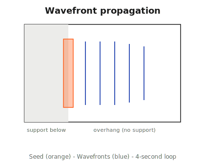

<div align="center">

<picture>
  
</picture>

# OrcaSlicer‑WaveOverhangs

**Print steep overhangs without supports.**
Fork of OrcaSlicer with wave‑pattern overhang printing, two pluggable algorithms, and a rich expert‑mode parameter space.

<br>

[](https://github.com/dennisklappe/OrcaSlicer-WaveOverhangs/releases)
[](https://github.com/dennisklappe/OrcaSlicer-WaveOverhangs/actions/workflows/build_all.yml)
[](https://github.com/dennisklappe/OrcaSlicer-WaveOverhangs/stargazers)
[](https://github.com/OrcaSlicer/OrcaSlicer/blob/main/LICENSE.txt)

> **⚠️ Experimental / Alpha.** Feedback and test prints welcome. Open an issue with your results.

</div>

---

## What are wave overhangs?

Wave overhangs is a slicing algorithm that lets you print 90‑degree overhangs without support material. Toolpaths are generated recursively based on wave‑propagation theory. Each new ring anchors to the previous one, and the pattern keeps propagating outward until it fills the available space, diffracting around corners and even around holes.

This fork ports the technique into OrcaSlicer and exposes two pluggable generators plus a large tunable parameter space, so people can experiment and find what works for their printer and material.


> Comparison of standard, arc‑overhang, and wave‑overhang toolpaths. Image from Janis A. Andersons' wave‑overhang research (see [Credits](#credits--research-references)).

---

## Main features

- **Two wave‑overhang algorithms** with an in‑GUI dropdown
  - **Andersons**: port of [stmcculloch/PrusaSlicer‑WaveOverhangs](https://github.com/stmcculloch/PrusaSlicer-WaveOverhangs). Arc‑overhang descendant with narrow‑region splitting and Smart/ZigZag/Monotonic pattern selection.
  - **Kaiser LaSO**: C++ reimplementation of [Rieks Kaiser's MSc thesis script](https://github.com/riekskaiser/wave_LaSO). Auto seed‑curve detection, multi‑overhang handling, pipeline‑integrated (no G‑code post‑processing). Still in research; shares the flow model with Andersons and works on simple overhangs, but complex geometries are unreliable.
- **Dedicated Wave overhangs tab** in Print Settings with grouped sections: General, Geometry, Algorithm tuning (algorithm‑specific rows appear per selected algorithm), Speed, Cooling, Floor layers, Support integration, Debug.
- **~20 expert tunables** for experimentation: line spacing, flow (mm³/mm), ring overlap, seam mode, spacing mode, pattern, perimeter overlap, minimum wave width, max iterations, authoritative floor layers, cooling overrides, and more.
- **Community test‑print database** at **[waveoverhangs.com](https://waveoverhangs.com)** where you can upload your results with settings and compare prints side‑by‑side.
- **Wave‑aware support integration**: supports only generate for overhang areas the wave couldn't cover.
- **G‑code debug markers**: `;WAVE_OVERHANG_CONFIG …` header block and per‑region `;WAVE_OVERHANG_START/END` tags for easy post‑process verification.
- **First‑launch config importer**: auto‑copies existing configs from OrcaSlicer, Bambu Studio, or PrusaSlicer so users don't start from zero.
- **100% opt‑in**: master toggle off means identical behavior to upstream OrcaSlicer.

---

## Download

Prebuilt binaries for tagged releases on the **[Releases page](https://github.com/dennisklappe/OrcaSlicer-WaveOverhangs/releases)**. Linux AppImage, Windows portable zip + installer, macOS universal DMG.

---

## Using wave overhangs

1. Launch the slicer, open a model with an overhang.
2. Go to **Print Settings → Wave overhangs** tab.
3. Toggle **Use wave overhangs (Experimental)** on.
4. Pick an algorithm (Andersons or Kaiser).
5. Slice and inspect the G‑code preview. Wave extrusions appear over detected overhang regions.

> **Simple mode** shows just the master toggle plus the algorithm dropdown.
> Switch to **Advanced** (top‑right mode selector) to tune individual parameters like line spacing, flow (mm³/mm), ring overlap, seam mode, etc.

For the full reference of every config option with tuning hints, see **[docs/WAVE_OVERHANG_SETTINGS.md](docs/WAVE_OVERHANG_SETTINGS.md)**.

> **Presets are intentionally not shipped yet.** The tunable space is large and we want community test prints to surface what actually works before baking in named bundles. Please leave your results at **[waveoverhangs.com/upload](https://waveoverhangs.com/upload)** so the dataset can grow.

---

## The algorithms

Both algorithms compute a **seed** at or near the supported edge of the overhang, then propagate rings outward from it into the unsupported region until the rings can't grow further inside the current layer.

- **Andersons** seeds from a narrow band along the support‑overhang boundary. Each iteration offsets the accumulated covered region outward and emits a polyline along the new front; a pattern mode (Smart / Monotonic / ZigZag) decides how the fronts connect.
- **Kaiser LaSO** seeds from the whole lower‑slice polygon shrunk inward by 2 × nozzle. Each iteration offsets the *previous ring* outward by `r` and emits it as a closed loop.



For the full contrast table, iteration flowcharts, Python → C++ mapping, and source pointers, see **[docs/ALGORITHMS.md](docs/ALGORITHMS.md)**.

---

## Building from source

Dependencies are the same as upstream OrcaSlicer: CMake ≥ 3.13, gcc or clang, GTK3, plus the bundled deps under `deps/`. See the upstream [OrcaSlicer build docs](https://github.com/OrcaSlicer/OrcaSlicer/wiki/how_to_build) for the full platform‑by‑platform guide.

```bash
# 1. Build bundled deps
cd deps && mkdir -p build && cd build
cmake .. && make -j$(nproc)

# 2. Build the slicer
cd ../..
mkdir -p build && cd build
cmake .. -DSLIC3R_STATIC=1 -DSLIC3R_GTK=3 -DCMAKE_PREFIX_PATH=$(pwd)/../deps/build/destdir/usr/local
make -j$(nproc)
```

---

## Current limitations

- **Experimental.** The tunable space is large (~20 knobs across two algorithms) and most parameter combinations have not been print‑tested yet. Expect rough edges. Please share what works and what doesn't at **[waveoverhangs.com](https://waveoverhangs.com)**.
- **Kaiser LaSO works on simple overhangs, not complex ones.** After the v0.2.0 anchor-band fix Kaiser now produces clean cantilever prints on simple convex overhangs, and now shares the flow model with Andersons. Complex geometries (concave shapes, narrow multi-arm supports) are still unreliable. Andersons remains the recommended default; try Kaiser on straight ridges where a strict lateral-offset pattern looks cleaner.
- **PLA recommended.** Wave overhangs need each ring to cool and become rigid before the next pass anchors to it. PLA with max part‑cooling works well. PETG, ABS and PC are likely to fail (PETG cools too slowly and delaminates under heavy fan). If you've tested other materials, please upload the results (success or failure) to **[waveoverhangs.com/upload](https://waveoverhangs.com/upload)**; failures are just as valuable for mapping out what's possible.
- **Warping on larger spans.** Laterally supported overhangs are prone to warping driven by thermal gradients, reheating of earlier layers, and nozzle pressure. Smaller overhangs print cleanly; larger spans may still need traditional supports. See **[docs/LIMITATIONS.md](docs/LIMITATIONS.md)** for the mechanisms and mitigations.
- **Kaiser pin supports are not ported.** Kaiser's original places discrete pin‑support nubs under overhangs. Not planned, since the goal here is fully support‑free overhangs. Use `support_remaining_areas_after_wave_overhangs` with Orca's normal supports if wave can't cover everything.
- **Platform testing status:** real‑print tested on Linux and Windows. macOS builds pass CI but haven't been validated against a physical printer yet.

---

## Credits & research references

**Wave overhang algorithm research**
> **Wave‑inspired path‑planning strategy for support‑free horizontal overhangs in FDM** (paper to be published).
> Reference Python implementation and interactive visualiser: [andersonsjanis/Wave‑overhangs](https://github.com/andersonsjanis/Wave-overhangs).
> Accompanying dataset (placeholder while paper is in review): [10.17632/xhw8xkjyc2.1](https://data.mendeley.com/datasets/xhw8xkjyc2/1).
> Authors: **Janis A. Andersons**, **Salomé Sanchez**, **Tom Vaneker**.

**Arc‑overhang algorithm** (the predecessor wave overhangs builds on)
> Steven McCulloch: [stmcculloch/arc‑overhang](https://github.com/stmcculloch/arc-overhang)

**PrusaSlicer integration of wave overhangs** (what our Andersons port is based on)
> Steven McCulloch: [stmcculloch/PrusaSlicer‑WaveOverhangs](https://github.com/stmcculloch/PrusaSlicer-WaveOverhangs)

**Kaiser LaSO algorithm** (the second algorithm in this fork)
> Rieks Kaiser: [riekskaiser/wave_LaSO](https://github.com/riekskaiser/wave_LaSO)
> *Investigating the warping of Laterally Supported Overhangs in fused deposition modelling, the Python code.*
> Written in the context of Rieks Kaiser's master thesis (Mechanical Engineering, University of Twente).

**OrcaSlicer base**
> OrcaSlicer team: [OrcaSlicer/OrcaSlicer](https://github.com/OrcaSlicer/OrcaSlicer)

---

## Contributing

- Open issues for bugs, feature requests, or print failures.
- PRs welcome. Base off `main`.
- When reporting test results, please share: model, algorithm and parameter values used, printer, photos, G‑code snippet.

License: **AGPL‑3.0** (inherited from OrcaSlicer).
