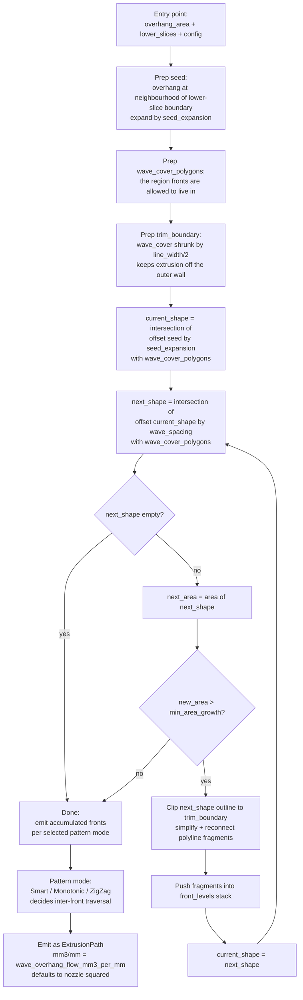

# Wave Overhang Algorithm

This document explains how the wave-overhang generator builds toolpaths, how it iterates step by step, and where to find the source that implements it.

## Contents

1. [Overview](#overview)
2. [How it iterates](#how-it-iterates)
3. [Key parameters](#key-parameters)
4. [Source](#source)

---

## Overview

The generator computes a **seed** geometry at or near the supported edge of the overhang, then propagates wavefronts outward from that seed into the unsupported region. Each new front bonds to the previous one. The loop ends when fronts can no longer grow further inside the current layer.

The seed is a narrow band along the support-overhang boundary. Each iteration offsets the accumulated covered region outward by the configured line spacing and emits a polyline along the new front. A pattern mode (Smart / Monotonic / ZigZag) controls how the resulting fronts are traversed.

## How it iterates

## Key parameters

- `wave_overhang_line_spacing`: distance between successive wavefronts
- `wave_overhang_pattern`: Smart / Monotonic / ZigZag, affects how fronts are traversed after all are generated
- `wave_overhang_perimeter_overlap`: how far waves extend toward the outer wall
- `wave_overhang_minimum_width`: split waves at narrow necks narrower than this
- `wave_overhang_min_new_area`: saturation threshold
- `wave_overhang_flow_mm3_per_mm`: per-millimetre extruded volume; see [shared flow setting](#flow-setting)

## Flow setting

`wave_overhang_flow_mm3_per_mm` controls how much plastic is extruded per millimetre of wave-overhang line. The default is `0.16` mm³/mm, which equals `nozzle²` for a 0.4 mm nozzle.

Why a fixed mm³/mm rather than a layer-height-dependent ratio: a wave-overhang line hangs in air, not squished against a layer below. There's nothing to squish into, so layer height has no effect on the bead's cross-section. Only the nozzle bore and the mm³/mm extrusion rate set the bead size.

Recommended values for other nozzle sizes:

| Nozzle | `wave_overhang_flow_mm3_per_mm` |
|---|---|
| 0.3 mm | 0.09 |
| 0.4 mm | **0.16 (default)** |
| 0.5 mm | 0.25 |
| 0.6 mm | 0.36 |
| 0.8 mm | 0.64 |

Raise if wave lines look thin or broken; lower if they blob together.

## Source

- `src/libslic3r/WaveOverhangs/WaveOverhangs.cpp`: the algorithm body
- `src/libslic3r/WaveOverhangs/AndersonsGenerator.cpp`: pluggable wrapper
