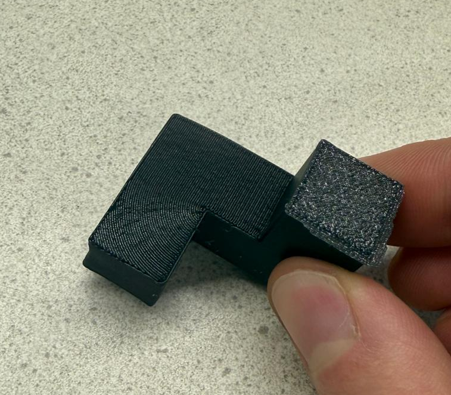
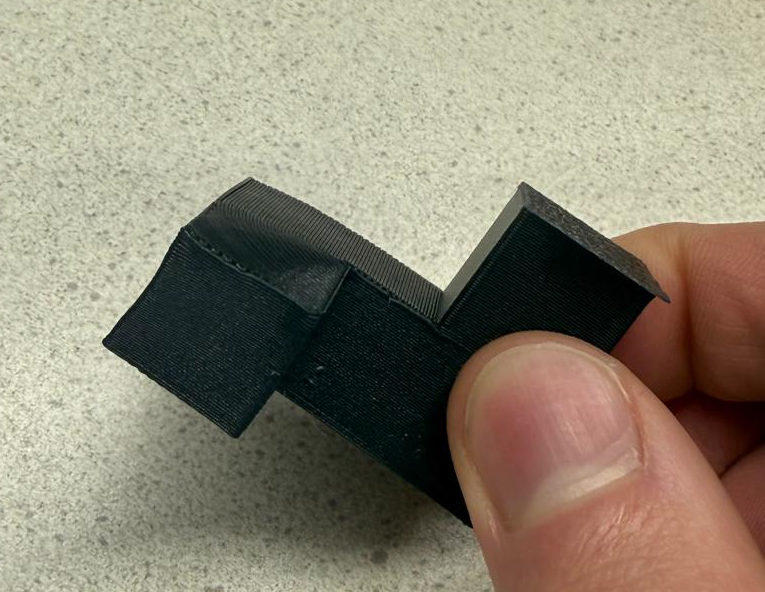
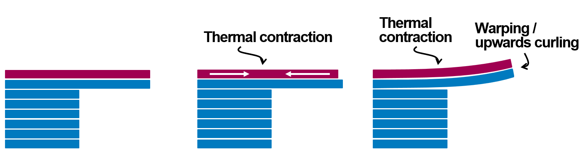
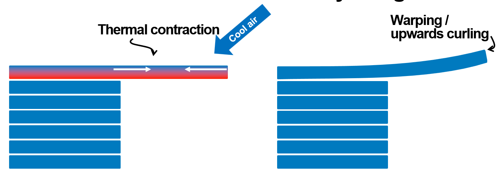
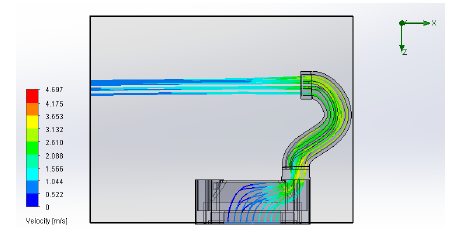
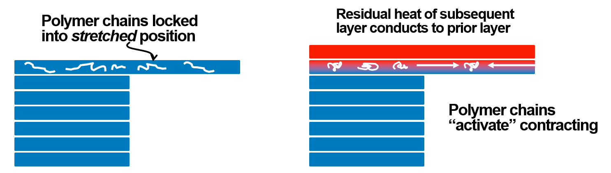
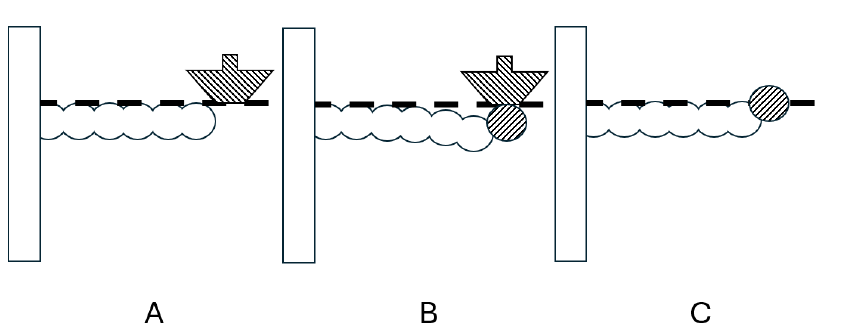
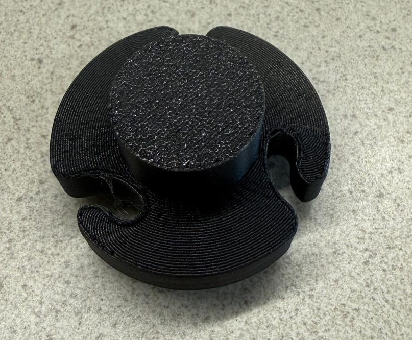
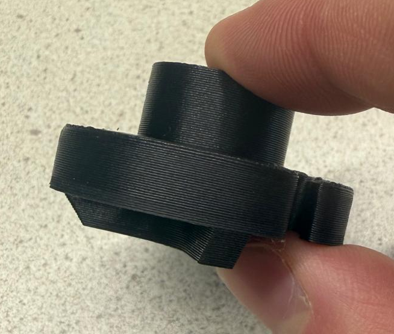

# Limitations

This page covers the current limitations of wave overhangs, focused on the hardest unresolved issue: **warping of laterally supported overhangs**.

Most of the diagrams below come from the underlying wave-overhang research (see [References](#references)).

---

## Warping

Warping is not a single failure mode with a single fix. Better cooling helps in some cases but doesn't solve the whole problem. Some experiments even suggest the opposite: *reducing* cooling to let the overhang sag slightly and compensate upward curl. The takeaway: it's a coupled thermal, mechanical, and process-control problem, not a pure fan-tuning issue.

  
  

## Main warping mechanisms

Several mechanisms can act at the same time. Current working hypotheses:

### Thermal contraction from temperature gradients

When different parts of a feature cool at different rates they want to contract by different amounts. That creates residual stress, and residual stress creates deformation. Adding layers above the unsupported region tends to curl the structure upward regardless of whether the base path was arcs, waves, or something else.

 [^1]

Single-layer overhangs aren't immune either. The first overhanging layer can develop a temperature gradient when cooling is applied mostly from above (top of the strand cools faster than the bottom).

 [^1]

One way to isolate this: cool the unsupported layer more evenly from both sides. A custom duct built for that purpose measurably reduced single-layer warping in testing.

 [^1]

### Shape memory polymer effects

Deposited plastic can lock polymer chains into a stretched or non-equilibrium state. When a later layer reheats the earlier one, those chains can become mobile and contract, producing additional deformation that's hard to predict from geometry or cooling alone.

 [^1]

### Nozzle pressure on large spans

On large single-layer spans, the pressure of the extruding filament and the nozzle interaction can physically push the unsupported region downward during deposition. Once early tracks are displaced, later tracks lay slightly higher and distortion cascades.

 [^1]

## Span matters

These warping mechanisms overlap, and severity is strongly span-dependent. Smaller unsupported regions can print cleanly while larger ones curl aggressively.

  
  

Practical implication: treat wave overhangs as a tool for **smaller, self-contained** overhang regions. Large cantilever spans will still probably need traditional supports.

## Practical mitigations

Things that have helped in testing so far:

- **Material choice:** PLA works best. PETG / ABS / PC are much more likely to delaminate or warp.
- **Tune the layers above the overhang:** the first 1 to 3 layers *above* the wave region often do most of the pulling. Slower speed, reduced flow, or extra cooling on those layers can make a visible difference. See `wave_overhang_floor_layers` in [WAVE_OVERHANG_SETTINGS.md](WAVE_OVERHANG_SETTINGS.md).
- **Cooling strategy:** default to max part-cooling on the wave layer itself; experiment with the layers above.
- **Nozzle temperature:** lower end of the material's working range tends to reduce reheating-induced relaxation.
- **Size limits:** if your overhang is larger than a few cm, consider falling back to traditional support material.

## Current takeaway

Warping is a known and unsolved issue. It significantly limits the size of overhangs that can be printed unsupported. Which mechanisms dominate in a given print, and how far slicer tuning can mitigate them, is still an active question.

The strongest levers today appear to be: **material choice, tuning of the layers above, cooling strategy, nozzle temperature, and being realistic about span size**.

---

## References

[^1]: "Wave-inspired path-planning strategy for support-free horizontal overhangs in FDM," research preprint, submitted for publication.
